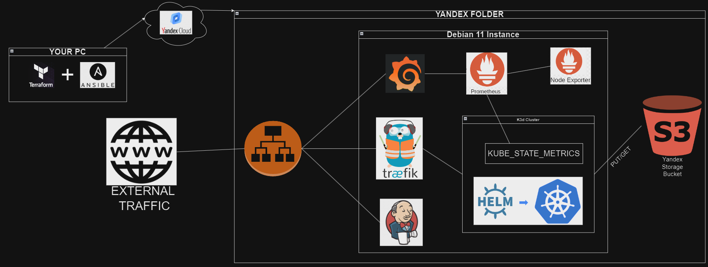
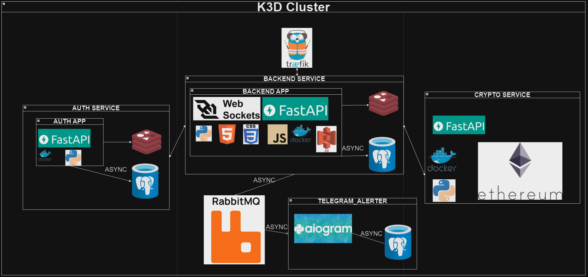

<h1>Проект web_store (EthB2B).</h1>
Проект IaC в облаке Yandex Cloud. 
Terraform создает ВМ, балансировщики и S3, а Ansible устанавливает и настраивает приложения.
Сам проект представляет real-time аукцион вещей, созданный на микросервисной архитектуре, работающей по WebSocket с клиентом.
Пользователи указывают свои криптокошельки и предлагают свою цену за товар, причем данная сумма должна присутствовать.
Приложение находится в Kubernetes кластере, Jenkins осуществляет CI/CD приложения, обновления приложения происходят через Helm стратегией rolling update для Deployments.
Prometheus собирает метрики от Node_exporter и kube_state_metrics для визуализации в Grafana.
Для отправки сообщений в архитектуре имеется RabbitMQ и микросервис забирающий из него сообщения и отправляющий рассылку о новых лотах через Telegram бота.

<b>Инфраструктурная схема проекта:</b>

Все приложения и инфраструктура создаются связкой Terraform и Ansible в облаке Yandex Cloud. Само микросервисное приложение находится в кластере Kubernetes.
Описание элементов данной схемы:
 - <b>Traefik(встроен в Kubernetes кластер).</b> Балансирует нагрузку на наше веб приложение.
 - <b>Kubernetes кластер.</b> Был выбран k3d для развертывания кластера Kubernetes. В нем работает само веб приложение, за обновление и развертывание которого отвечает Helm. Также он выдает метрики kube_state_metrics для сбора метрик Prometheus.
 - <b>Jenkins.</b> Совершает CI/CD приложения. Строит новые образы Docker, отправляет в DockerHub, совершает обновление приложения с помощью Helm стратегией Rolling update.
 - <b>Grafana.</b> Визуализирует метрики выдаваемые Prometheus
 - <b>Prometheus.</b> Собирает метрики от kube_state_metrics и node_exporter.
 - <b>S3 бакет</b> Хранит картинки для лотов, которые выставили пользователи.

<b>Архитектура приложения в кластере Kubernetes:</b>

Описание 
Технологии: Terraform, Ansible, Prometheus, Grafana, Kubernetes, Helm, Jenkins, Redis, Docker, S3, PostgreSQL, Python.
